## bamazon
Basic node applications to track inventory of imaginary store using mySQL

# How the Customer Node App Works
When the program is run, the customer is prompted to enter the item number they would like to purchase or enter help to see a list of products.
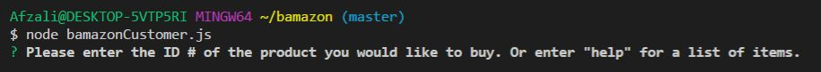

The customer enters the item number and the quantity. Then the program thanks them for their purchase and shows them their total cost.
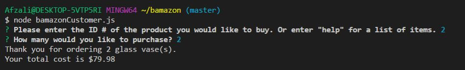
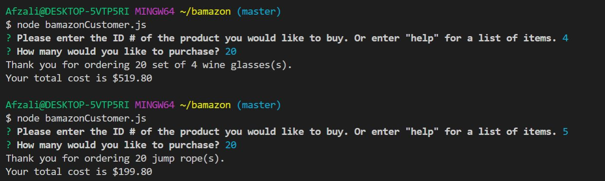

If there is insufficient stock the program tells the customer and shows them how many are available. The program is then restarted so they can change their order.
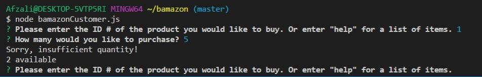

If the customer enters 'help', the program lists all item information and re-prompts for the item number.
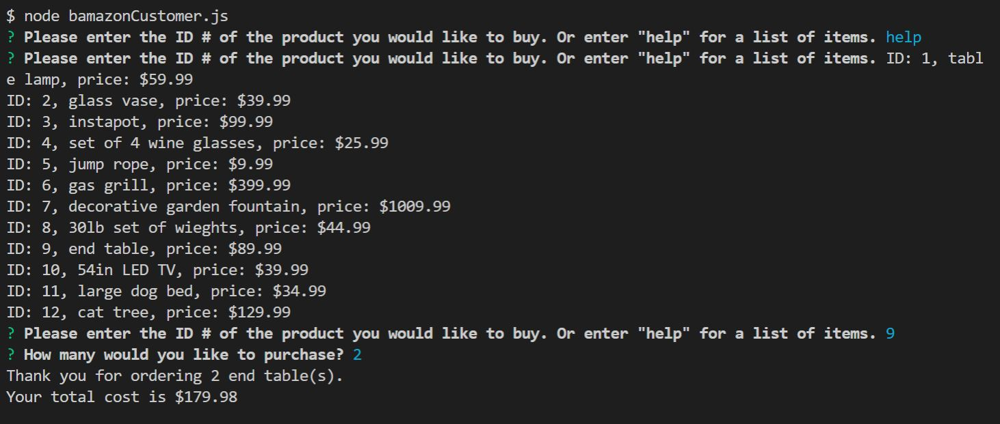

Below you can see that the inventory updates when a customer makes a purchase.
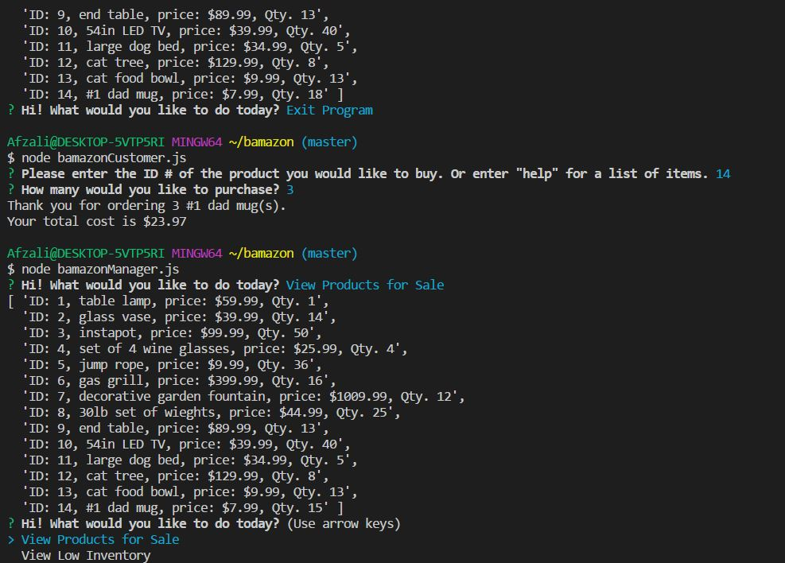

# How the Manage Node App Works
When the bamazonManager.js app is run, a menu appears that gives the user the following options:

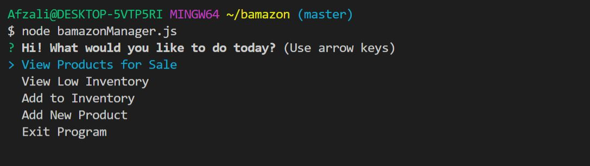

If the user selects "View Products for Sale", a list of the products is displayed and the root menu is displayed again. 

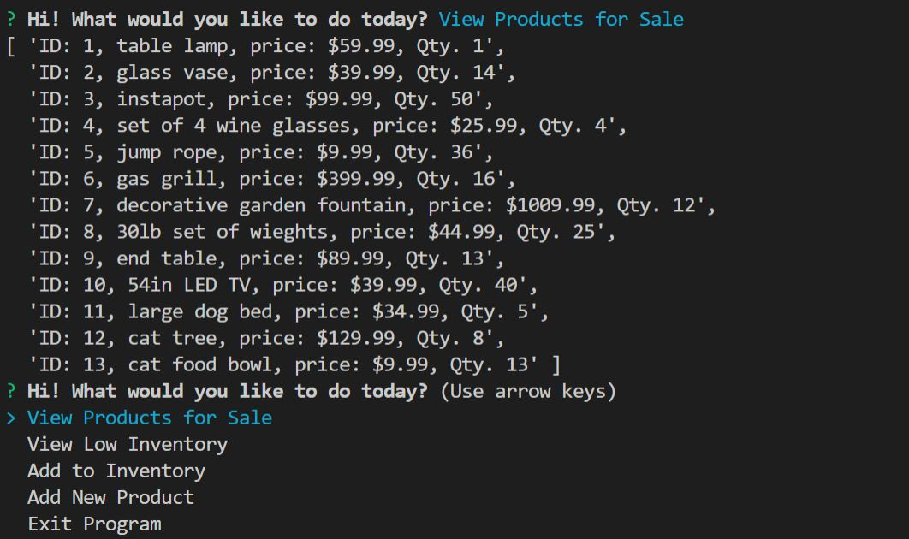

If the user selects "View Low Inventory", a list of products with 5 or less are displayed and the root menu is displayed again.

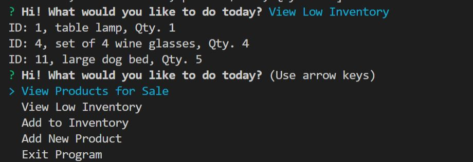

If the user selects "Add to Inventory", they are asked for the id of the item to update and the quantity to update. An error is returned on this one, so I am still trouble shooting it.

If the user selects "Add New Product", they are asked for the item name, the item department, the item quantity and the price. Below is a screenshot of the inventory before adding an item, and a screenshot of the prompts to add an item and the new inventory list.

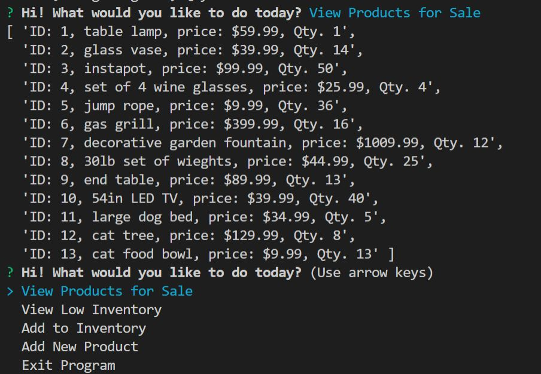
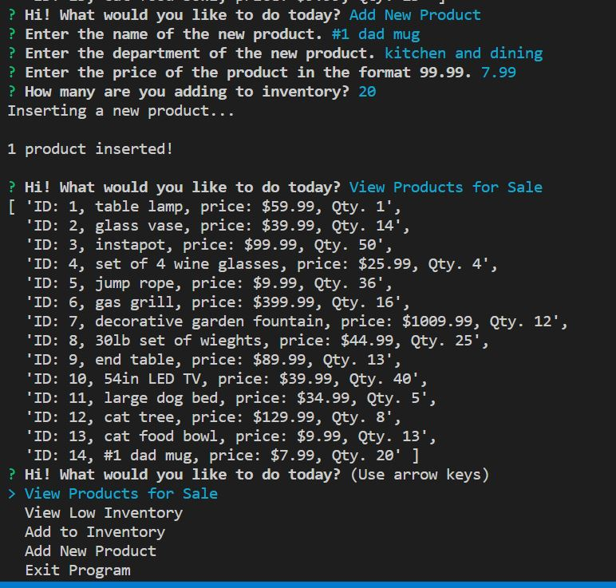

If the user selects "Exit Program" the program ends.
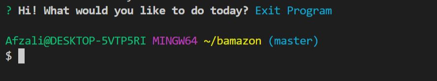